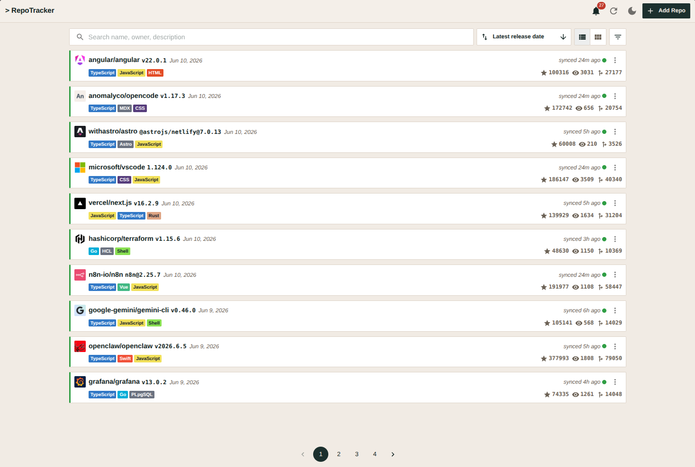

# RepoTracker

A web application for tracking GitHub repositories and their release activity.
Add repositories by URL, see the latest release per repo (version and date),
mark releases as "seen", and let unseen updates stand out at a glance. A backend
keeps release data current through on-demand refresh and a periodic background
sync.

The value: replace ad-hoc checking of many repos' release pages with a single
dashboard that surfaces only what's new since you last looked.

### Previews

The home screen, showing seeded demo data:



## Project layout

```
backend/    Node + TypeScript, Apollo Server (GraphQL), Prisma/Postgres, Octokit
frontend/   React + TypeScript (Vite), MUI, Apollo Client
.ref/       Design docs — prd.md (product), techdesign.md (technical), specs/
```

Backend and frontend are standalone yarn projects; each has its own
`package.json`, install, and scripts.

## Prerequisites

- Node.js 20+
- Yarn 4+ (managed via Corepack)
- Docker (for the local Postgres container)
- A GitHub personal access token (optional — see below; raises the API rate limit)

## Setup and local run

### 1. Start Postgres

From the repository root:

```bash
docker compose up -d postgres
```

This runs `postgres:16` with the defaults the backend expects: database
`release_tracker`, user `postgres`, password `postgres`, on port `5432`.

### 2. Backend

```bash
cd backend
cp .env.example .env
# optionally set GITHUB_TOKEN (see below) for a higher rate limit
yarn install
yarn prisma migrate deploy   # apply the schema to the database
yarn seed                    # optional: populate demo data (no token needed)
yarn dev                     # or: yarn build && yarn start
```

The GraphQL server listens at `http://localhost:4000/`.

**`GITHUB_TOKEN` is optional but recommended.** Tracking and syncing public
repos works unauthenticated, but GitHub caps unauthenticated requests at 60 per
hour per IP; an authenticated token raises the limit to 5,000 per hour. Without
a token the app falls back to unauthenticated requests and surfaces a clear
`RATE_LIMITED` error if the limit is hit. Create a fine-grained or classic PAT
with public-repo read scope at https://github.com/settings/tokens and paste it
into `GITHUB_TOKEN` in `backend/.env`.

**Demo data (`yarn seed`)** populates the database with the implicit demo user
and a few dozen well-known repositories (React, VS Code, Node.js, Vite, Deno,
Kubernetes, and more) using static snapshot values — enough to span several
pages so pagination is exercised. It makes no GitHub calls, so the app shows
meaningful data on first load even without a token, with some repos already
marked unseen and a spread of sync ages so the unseen and freshness indicators
are visible. The seed is idempotent — re-running overwrites the same rows and
leaves seen state intact.

### 3. Frontend

```bash
cd frontend
cp .env.example .env         # VITE_GRAPHQL_URL points at the backend
yarn install
yarn dev                     # Vite dev server at http://localhost:5173
```

## Running tests

```bash
# Backend — Vitest unit/integration tests
cd backend && yarn test

# Frontend — Vitest component/functional tests
cd frontend && yarn test

# End-to-end — Playwright (requires a running backend + frontend and a token)
cd frontend && yarn test:e2e
```

The Playwright spec at `frontend/test/core-loop.spec.ts` exercises the core demo loop
through the real UI against a live stack; it needs both servers running and a
configured `GITHUB_TOKEN`.

## What's implemented

- **Track repositories** by GitHub URL; tracked repos persist in Postgres.
- **Latest release per repo** — name, description, version, and release date,
  with the version as the primary signal.
- **Mark as seen** — a per-user watermark records the last acknowledged version;
  a repo is unseen when its latest release differs from that watermark.
- **Unseen indicator and count** — repos with unseen updates are visually
  distinct, and a toolbar count doubles as an unseen quick-filter.
- **Manual refresh** — per-repo and refresh-all, fetching current data from
  GitHub on demand.
- **Periodic background sync** — an in-process `node-cron` job sweeps tracked
  repos on a schedule and overwrites their release and metadata in place.
- **Repo metadata** — author (owner avatar/URL), stars, watchers, forks, and the
  top three languages, plus a sync-freshness indicator.
- **Search and filter** over the tracked list, with offset pagination.
- **GraphQL API** (Apollo Server) consumed by the React frontend through Apollo
  Client's normalized cache, satisfying the client-side caching requirement.

The GraphQL contract: `trackedRepos(search, filter, page, pageSize)` and
`previewRepo(url): RepoPreview` queries; `trackRepo`, `untrackRepo`,
`markSeen`, `refreshRepo`, and `refreshAll` mutations.

## Trade-offs

Deliberate simplifications scoped to keep the system small while still
demonstrating production patterns:

- **Latest release only, no history.** Each repo stores only its most recent
  release, denormalized onto the repo row. The seen marker is the version a user
  last acknowledged. This answers "which repos have something new?" with the
  least machinery, at the cost of any per-release changelog or detail view.
- **In-process polling sync.** The sync job runs inside the backend on a
  `node-cron` schedule and shares its logic with the refresh mutations, rather
  than running as a separate worker. Simpler to deploy; less isolated under load.
- **Single implicit user, no auth.** The data model is fully multi-tenant
  (per-user tracked repos and seen markers), but the app operates as one implicit
  demo user with no login flow.
- **Offset pagination.** Page/pageSize connections rather than cursor-based,
  which is simpler but less efficient at deep offsets.
- **Full-overwrite syncs, no locking.** A sync is a plain full-row update, so a
  concurrent cron sweep and manual refresh at worst produce a redundant write,
  never corruption.
- **Apollo Client for the data layer.** A GraphQL-native client with a
  normalized cache keeps the UI consistent with the least hand-written code:
  mutations that return the updated repo patch the cache by identity, so views
  update in place without manual re-syncing.

## Future work

The production evolution of each trade-off:

- **Separate sync worker.** Extract the sync job into its own queue-driven
  worker (e.g. BullMQ/Redis) with per-repo locking. The logic already lives
  behind a clean service entrypoint, so this is a packaging change.
- **Webhook-driven sync.** Replace polling with GitHub webhooks for real-time
  release updates.
- **Release history and changelog.** Add a release table to back a per-release
  detail/changelog view alongside the latest-release dashboard.
- **OAuth and multi-user.** Inject `userId` from an authenticated session
  (GitHub OAuth) so tracked repos and seen state scope to real accounts.
- **Cursor-based pagination.** Relay-style cursor connections to avoid
  deep-offset cost.
